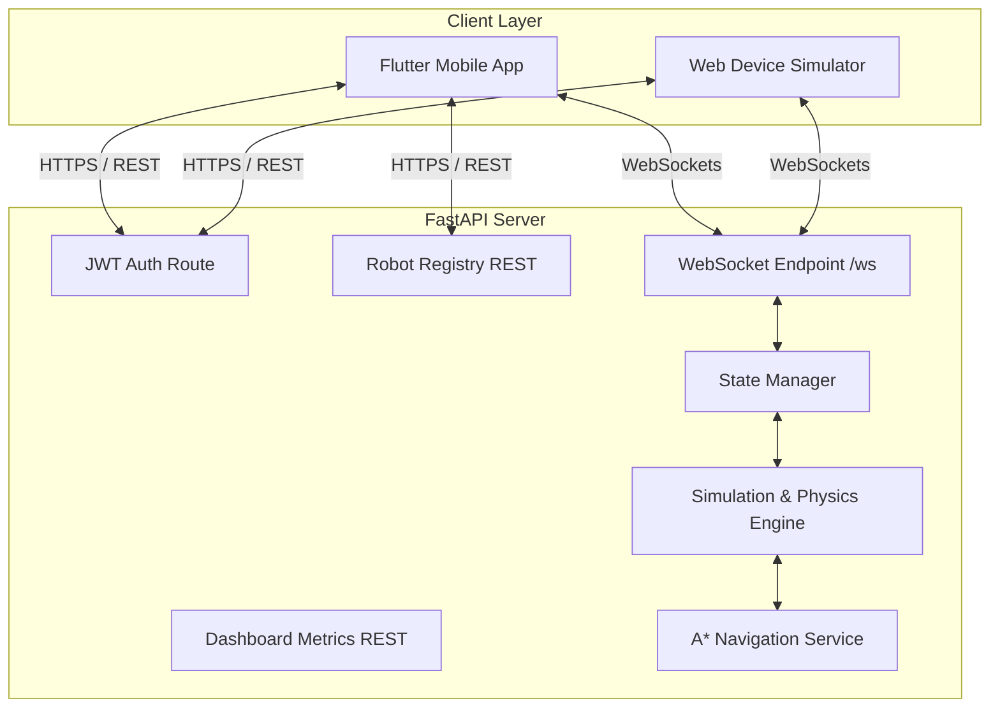

# bluCursor Robot Simulator - Developer Documentation

Welcome to the **bluCursor Robot Simulator & Fleet Control Center** developer documentation. This document is designed to help new and existing developers understand the project architecture, tech stack, directory structure, communication protocols, and local setup instructions.

---

## 1. Project Overview

The project is an enterprise-grade hybrid robot simulation system designed to monitor, track, and manually override a fleet of virtual robots (e.g., ARES-100, HERMES-Lite, ZEUS-Surveyor). 

The system consists of three main parts:
1. **Flutter Mobile Application**: A premium mobile app containing the operator dashboard, active fleet registry, real-time telemetry feeds, map visualization, and tactile manual controls.
2. **FastAPI Python Backend**: A high-performance REST and WebSocket server managing robot state, telemetry broadcasting, A* autonomous navigation pathfinding, and movement physics.
3. **Web-Based Device Simulator**: A browser-based mockup container (`index.html` / `app.js`) that simulates the phone UI on the web for previewing and testing.

---

## 2. System Architecture

The following diagram illustrates how the components interact:



---

## 3. Tech Stack

- **Frontend Core**: Flutter (Dart)
- **Styling & Fonts**: Google Fonts (Outfit, JetBrains Mono)
- **Backend API**: Python 3.9+, FastAPI, Uvicorn, Pydantic, python-jose (JWT)
- **Web Simulator**: HTML5, Vanilla CSS3 (Custom Variables, Cyberpunk Theme), Vanilla JavaScript
- **Protocols**: REST (JSON) over HTTP/S, Bidirectional WebSockets

---

## 4. Directory Structure

```
Mobile application project/
│
├── README.md                          # Global Developer Documentation (This File)
├── index.html                         # Web Command Center & Device Simulator
├── style.css                          # Web Command Center CSS styling
├── app.js                             # Web Simulator client script & Mock database
├── app-release.apk                    # Compiled Android Release Binary
│
├── lib/                               # Flutter Frontend Codebase
│   ├── main.dart                      # App entry point and routes definition
│   ├── models/
│   │   └── robot.dart                 # Client-side Robot model & sample registry
│   ├── services/
│   │   └── api_service.dart           # REST calls and WebSocket stream listener
│   ├── theme/
│   │   └── app_theme.dart             # Dark/Light Material3 theme tokens
│   └── screens/
│       ├── splash_screen.dart         # Boot sequence simulator
│       ├── login_screen.dart          # Biometric & operator login page
│       ├── greeting_screen.dart       # Welcome splash screen
│       ├── dashboard_screen.dart      # Main dashboard, radar sweep & quick commands
│       ├── delivery_cart_screen.dart  # Delivery mission selector
│       ├── patrolling_screen.dart     # Patrol mission selector
│       ├── control_panel_screen.dart  # Tactile D-Pad manual robot controller
│       ├── real_time_viz_screen.dart  # Telemetry viz on map, battery & speed rings
│       └── settings_screen.dart       # Operator configuration panel
│
└── backend/                           # Python Backend Codebase
    ├── app.py                         # FastAPI App initialization & route mounting
    ├── requirements.txt               # Backend dependencies
    ├── core/
    │   ├── jwt_handler.py             # JWT token generation and verification
    │   ├── logger.py                  # User activity & command logging
    │   └── websocket_manager.py       # WS connection manager (connect, disconnect, broadcast)
    ├── data/
    │   ├── maps.py                    # Grid dimensions (20x20) and obstacle list
    │   └── robots.py                  # Default robots list (R-01 to R-05)
    ├── models/
    │   └── robot.py                   # Pydantic schemas (Robot serializable model)
    ├── routes/
    │   ├── auth.py                    # Login and JWT token endpoint
    │   ├── dashboard.py               # Aggregated fleet statistics REST endpoint
    │   ├── robots.py                  # Fleet list and details REST endpoint
    │   └── websocket.py               # WS connection endpoint and command dispatcher
    └── services/
        ├── robot_service.py           # Database accessor functions
        ├── state_manager.py           # In-memory robot status & normalization
        ├── telemetry_service.py       # Telemetry JSON builders
        ├── simulation_service.py      # Manual controls & physics engine (forward, backward, rotate)
        └── navigation_service.py      # Autonomous A* pathfinder and movement loop
```

---

## 5. WebSockets Communication Protocol

Communication during active robot operations occurs in real-time over WebSocket channels connecting to the `/ws` endpoint.

### 5.1 Connection
Client connects to:
`ws://<host>/ws?token=<JWT_TOKEN>`

### 5.2 Incoming Client Commands (Client -> Server)

#### 1. Manual Move Command (`MOVE`)
Sent when the operator taps on D-pad control buttons:
```json
{
  "type": "MOVE",
  "robot_id": "R-01",
  "payload": {
    "command": "forward" // or "backward", "rotate_left", "rotate_right"
  }
}
```
*Note: In-place rotations (`rotate_left` / `rotate_right`) alter heading angle by 90 degrees without translating. Translations (`forward` / `backward`) calculate direction vectors based on the current angle.*

#### 2. Start Autonomous Navigation (`START_AUTO`)
Tells the robot to calculate an A* path and move automatically from point A to B:
```json
{
  "type": "START_AUTO",
  "robot_id": 1,
  "payload": {
    "start_x": 4.0,
    "start_y": 4.0,
    "destination_x": 12.0,
    "destination_y": 14.0
  }
}
```

#### 3. Stop Autonomous Navigation (`STOP_AUTO`)
```json
{
  "type": "STOP_AUTO",
  "robot_id": 1
}
```

### 5.3 Outgoing Telemetry Broadcast (Server -> Client)
Broadcasting occurs on every state update, movement step, or status change:
```json
{
  "type": "TELEMETRY",
  "robot_id": "R-01",
  "robot_name": "ARES-100",
  "position": {
    "x": 12.4,
    "y": 7.4
  },
  "angle": 0.0,
  "direction": "North",
  "battery": 87,
  "speed": 0.8,
  "status": "Moving",
  "mode": "Manual",
  "current_task": "Active now",
  "map": "Floor Map A",
  "online": true,
  "auto_navigation": false
}
```

---

## 6. Local Development Setup

### 6.1 Backend Setup
1. Enter the `backend` directory:
   ```bash
   cd backend
   ```
2. Create and activate a Python virtual environment:
   ```bash
   python -m venv venv
   # Windows:
   venv\Scripts\activate
   # macOS/Linux:
   source venv/bin/activate
   ```
3. Install dependencies:
   ```bash
   pip install -r requirements.txt
   ```
4. Start the development server:
   ```bash
   uvicorn app:app --reload
   ```
5. Access Swagger API docs at `http://127.0.0.1:8000/docs`.

### 6.2 Web Simulator Setup
1. Set up a local HTTP server at the root directory:
   ```bash
   # Run the preview script on Windows:
   preview_on_phone.bat
   # Or run python's static server directly:
   python -m http.server 3000
   ```
2. Open `http://localhost:3000` in your web browser.

### 6.3 Flutter Mobile App Setup
1. Ensure the Flutter SDK is installed and configured (`flutter doctor`).
2. Run standard Flutter setup:
   ```bash
   flutter pub get
   ```
3. Run on an emulator or connected device:
   ```bash
   flutter run
   ```
4. To compile the production release Android package:
   ```bash
   flutter build apk --release
   ```
   The output APK will be generated at `build/app/outputs/flutter-apk/app-release.apk`.

---

## 7. Deployment Details

### GitHub
The repository is hosted at `https://github.com/Nandini05060/Robot-Simulator.git`. 
When building a new mobile binary, copy `build/app/outputs/flutter-apk/app-release.apk` to the root directory, stage it, commit, and push.

### Render
The FastAPI backend is hosted on Render at `https://robot-simulator.onrender.com`. Pushing commits to the `main` branch of the GitHub repository triggers an automatic git-hook compilation and deployment on Render.
